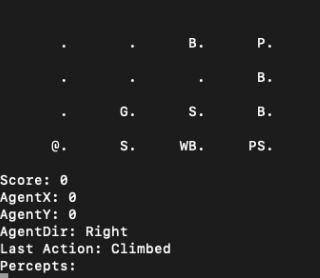

# :computer: Wumpus World Game
The Wumpus World is a game that involves an Agent(the AI) that has to travel inside of different types of caves to find gold. Inside the cave the agent can encounter two types of
dangers, either the Wumpus Monster or a Pit. If the Agent runs into the Wumpus or falls into a Pit, the agent will die and lose the game. The agent cannot see 
where it is going when traveling inside of the cave but it can perceive a Stench, which will indicate the Wumpus is close by, or perceive a Breeze, which will indicate
a Pit is close by. The Agent has one Arrow which can be used to kill the Wumpus, but the Agent has to shoot it in the direction of the Wumpus for it to die.
The Agent will know the Wumpus is dead if they perceive a Scream after shooting the Arrow. Killing the Wumpus is not required, but might be needed if the gold is
in the same location as the Wumpus. The objective of the game is for the Agent to travel inside of the cave, find the gold, return back to the beginning and climb
out of the cave all while avoiding the Wumpus Monster and falling into a Pit.

# :pencil: AI Design
&nbsp;&nbsp;&nbsp;&nbsp;In the game the AI is the Agent traveling inside of a NxM cave trying to find the gold. The AI is tested on randomly generated worlds in which on average it 
tries to achieve the best score possible. It does so by prioritizing not running into the Wumpus nor falling into a pit which will automatically cause
the Agent to lose the game and result in a score less than -1000 points. If the agent scores -1000 points it lower the agents average score which will reflect
badly on its efficiency; however the AI is designed to be precautious so that it will never die and will instead end the game even if it did not find the gold. 
The Agent moves around the cave by taking Actions: TURN_LEFT, TURN_RIGHT, or move FORWARD, each action costing -1 point. The agent can only move FORWARD to a 
new location [x,y] if the Agent is Facing the direction that the location is in. The Agent has four directions it can be facing UP, DOWN, LEFT, and RIGHT -- 
turning to each desired direction will cost -1 points.  
&nbsp;&nbsp;&nbsp;&nbsp;When the game starts the Agent is located at cell [0,0], facing Right, carrying 1 Arrow and is able to perceive
if there is a Breeze, a Stench, or Gold. If on the first cell the agent perceives Gold it will grab it and CLIMB out and win the game. If it perceives a Breeze on 
the first cell, it will CLIMB out right away because there is a 50% that next location, up or down, is a Pit. Moving to any cell is too much of a risk so instead 
of resulting in a score of -1000 the agent will CLIMB out and result in a score of -1. If on the first cell the Agent perceives a Stench that indicates that the 
Wumpus is
either in the next cell on the right or on the cell above. If the Agent shoots the arrow while facing Right there is a 50% chance the Wumpus will die and if it 
doesn't die, it will indicate that it is in the cell above. If there is nothing to perceive on the first cell, the Agent will generate locations that
are within range to visit. 
&nbsp;&nbsp;&nbsp;&nbsp;The AI chooses a location to visit next by calculating the cost of amount of Actions needed to visit that location. The Agent keeps 
a history of visited locations to avoid visiting the same location more than once. If the Agent encounters a Breeze or a Stench the AI is designed to go back one 
cell in order to avoid dying and will mark all the surrounding cells as dangerous. When the Agent visits a new location it will add the location to the current
trail its on and when it goes back one it will remove that location from the current trail. The current trail is different from the history of all the 
visited locations and it is useful for the AI when the Agent wants to go back to the starting point. When the Agent finds the gold it will initiate a back tracking 
sequence that will use the current trail that will lead back home. If the Agent runs out of safe locations to visit the AI will begin the back tracking sequence
to go back home and climb out even if the Agent doesn't have the Gold.

# :camera: Preview
<table>
  <tbody>
    <tr>
      <th align="center">Example</th>
      <th align="center">Map Info</th>
      <th align="center">Game Scoring</th>
    </tr>
    <tr>
      <td></td>
      <td>
        <ul>
          <li>.   = Tile</li>
          <li>@ = Player</li>
          <li>G = Gold</li>
          <li>W = Wumpus</li>
          <li>S = Stench</li>
          <li>P = Pit</li>
          <li>B = Breeze</li>
        </ul>
      </td>
      <td>
        <ul>
          <li> Agent starts with 0 points </li>
          <li> -1 point for each action made </li>
          <li> -11 points for shooting an arrow </li>
          <li>-1000 points for falling into a Pit </li>
          <li>-1000 points for Wumpus encounter</li>
          <li>+1000 points for finding the Gold</li>
          <li>Game Ends when agent climbs or dies</li>
        </ul>
      </td>
    </tr>
  </tbody>
</table>
